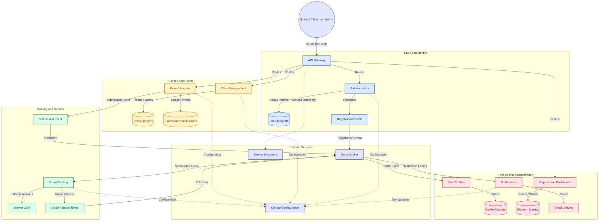

# Examsy — Microservices Architecture

This directory houses the microservices migration for the **Examsy Examination Platform**.

## Project Structure

```
Examsy-Microservice/
├── services/                     # Spring Boot microservices
│   ├── examsy-config-server/
│   ├── examsy-eureka-server/
│   ├── examsy-api-gateway/
│   ├── examsy-auth-service/
│   ├── examsy-profile-service/
│   ├── examsy-class-service/
│   ├── examsy-exam-service/
│   ├── examsy-grading-service/
│   ├── examsy-notification-service/
│   ├── examsy-admin-service/
│   └── examsy-analytics-service/
├── config-repo/                  # Git-backed config repo for Spring Cloud Config Server
├── infra/                        # Infrastructure definitions
│   └── docker/
│       └── mysql/
│           └── init.sql          # Multi-database initialization script
├── .github/
│   └── workflows/                # CI/CD action pipelines
├── docker-compose.yml            # Local dev stack (MySQL, Redis, Kafka, Services)

# Flow of the system
## System Architecture



└── .gitignore
```
