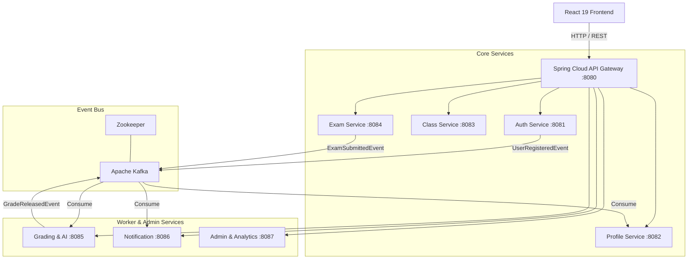
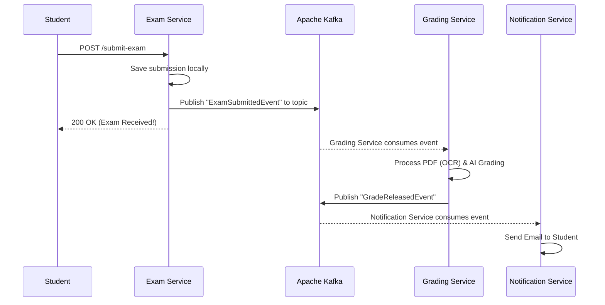

# 🎓 Examsy: The Complete Educational Guide to Microservices

Welcome to the comprehensive educational guide for **Examsy**, an enterprise-grade online examination and academic assessment platform. 

This guide is designed for **students and beginner engineers**. It doesn't just show you *what* we built; it explains *why* we built it and teaches you the **fundamentals of the underlying technologies** (Docker, Kubernetes, Kafka, CI/CD).

---

## 1. 🏗️ The Basics: Monolith vs. Microservices

### What is a Monolith?
A monolithic application is a single, unified codebase where all features (Authentication, Exam Taking, Grading, Profiles) are tightly coupled together and share a single database. 
*   **Pros:** Easy to develop initially, simple to deploy as one unit.
*   **Cons:** As the application grows, it becomes hard to scale. For example, if the heavy AI Grading process crashes because it ran out of memory, the entire application (including simple things like logging in) crashes with it. 

### What are Microservices?
In a Microservices Architecture, the application is divided into small, independent services. Each service handles a specific business domain (e.g., `examsy-auth-service`, `examsy-exam-service`) and has its own database.
*   **Pros:** High scalability (you can scale just the Exam service during finals week), fault isolation (if grading crashes, the rest of the app stays up), and technology flexibility.
*   **Cons:** Harder to deploy, requires complex monitoring, and introduces network latency.

### Examsy's High-Level Architecture



---

## 2. 🧩 The Microservices Ecosystem Basics

In Examsy, we use **Spring Cloud** to manage the complexity of microservices.

### Service Discovery Registry (Eureka)
*   **The Problem:** If the `Profile Service` needs to talk to the `Auth Service`, how does it know the IP address? Hardcoding IPs is bad because containers change IPs frequently.
*   **The Concept:** Eureka is like a phonebook. When a service starts up, it registers itself with Eureka (e.g., "I am AUTH-SERVICE and my IP is 10.0.0.5"). When another service needs to talk to it, it asks Eureka for the address.
*   **Examsy Implementation:** `examsy-eureka-server` (Port 8761).

### API Gateway
*   **The Concept:** Instead of the frontend trying to memorize the ports of 10 different services, it talks to a single Entry Point: The API Gateway. The Gateway routes the request to the correct microservice. It also handles global security (CORS) and rate limiting.
*   **Examsy Implementation:** `examsy-api-gateway` (Port 8080).

### Centralized Configuration
*   **The Concept:** Instead of changing database passwords in 10 different projects, we store all `application.properties` files in one central location. 
*   **Examsy Implementation:** `examsy-config-server` (Port 8888).

---

## 3. 📬 Event-Driven Architecture (Apache Kafka)

### What is Event-Driven Architecture?
Normally, services talk to each other synchronously (via HTTP/REST). The problem? If Service A calls Service B, and Service B is slow, Service A is stuck waiting. 
In Event-Driven Architecture, Service A simply shouts a message (an "Event") into a megaphone and moves on. Service B listens for that message and processes it whenever it's ready, entirely in the background.

### What is Apache Kafka?
Kafka is an open-source distributed event streaming platform. It acts as the "megaphone" and message storage system.
*   **Producers:** Services that send messages to Kafka.
*   **Consumers:** Services that listen to messages from Kafka.
*   **Topics:** Channels where messages are sent (like a YouTube channel you subscribe to).
*   **Zookeeper:** A centralized service that manages the Kafka brokers and keeps them organized.

### How Examsy Uses Kafka
When a student submits an exam, evaluating handwriting (OCR) and asking the AI to grade it takes a long time (sometimes 10+ seconds). If we made the student wait, their browser might time out.



---

## 4. 🗄️ Databases & Flyway Migrations

### The Database-per-Service Pattern
In Examsy, **we do not share databases.** The `Auth Service` has `examsy_auth_db`, and the `Exam Service` has `examsy_exam_db`.
*   **Why?** If the Exam database crashes due to millions of test submissions, the Auth database is unaffected, meaning users can still log in to the system.

### What is Flyway?
When developing locally, you might use Hibernate's `ddl-auto=update` to automatically create SQL tables based on your Java code. **This is highly dangerous in production**—it can accidentally delete columns or drop tables.
*   **The Concept:** Flyway is a database migration tool. You write actual SQL scripts (e.g., `V1__create_users_table.sql`, `V2__add_email_column.sql`) and put them in your project.
*   **How it works:** When your application starts, Flyway checks the database to see which scripts have been executed. It only runs the new ones, ensuring every developer and production server has the exact same database structure.

---

## 5. 🐳 Containerization (Docker)

### What is Docker?
*   **The Problem:** "It works on my machine, but it crashes on the production server!" This happens because developers and servers have different Java versions, OS settings, and environment variables.
*   **The Concept:** Docker packages your application code *and its entire environment* (Java runtime, OS libraries) into a single, standard unit called a **Container**. A container will run exactly the same way on a Mac, Windows, or Linux server.
*   **Images:** A read-only blueprint (like a class in Java).
*   **Containers:** A running instance of an Image (like an object in Java).

### Multi-Stage Dockerfiles in Examsy
Docker images can be very large. We use a trick called "multi-stage building":
1.  **Stage 1 (Builder):** We use a heavy image with the full JDK (Java Development Kit) to compile the code (`mvn clean package`).
2.  **Stage 2 (Runtime):** We take *only* the compiled `.jar` file and put it into a tiny image containing only the JRE (Java Runtime Environment). This makes the final image very small and secure.

### What is Docker Compose?
Instead of starting 10 microservices, Kafka, Zookeeper, MySQL, and Redis manually one by one, `docker-compose.yml` is a script that allows you to start the *entire* ecosystem with one command: `docker-compose up`.

---

## 6. 🎡 Cloud-Native Orchestration (Kubernetes)

### What is Kubernetes (K8s)?
If Docker runs a container, Kubernetes is the manager that oversees thousands of containers across many servers. If a Docker container crashes, Kubernetes automatically restarts it (self-healing). If web traffic spikes, Kubernetes automatically creates more copies of your container (autoscaling).

### Core Kubernetes Concepts
*   **Pod:** The smallest unit in K8s. A pod usually holds one Docker container.
*   **Deployment:** A blueprint that tells K8s how many identical Pods should be running at all times.
*   **Service:** Because Pods are constantly dying and being reborn with new IP addresses, a "Service" acts as a permanent IP address (load balancer) that routes traffic to the alive Pods.
*   **ConfigMap & Secret:** Safe ways to inject environment variables (like API keys and passwords) into your Pods without hardcoding them in your code.
*   **Ingress:** The "front door" of the cluster. It routes internet traffic (e.g., `api.examsy.com`) to the correct internal Service.
*   **HPA (Horizontal Pod Autoscaler):** A system that monitors CPU/Memory. In Examsy, if the `examsy-exam-service` hits 70% CPU usage, the HPA will automatically create more Exam pods to handle the load.

```mermaid
graph TD
    Internet[Internet / Users] --> Ingress[NGINX Ingress]
    
    Ingress --> GatewaySVC[Gateway Service]
    GatewaySVC --> GatewayPod[Gateway Pod]
    
    GatewayPod --> AuthSVC[Auth Service]
    GatewayPod --> ExamSVC[Exam Service]
    
    AuthSVC --> AuthPod1[Auth Pod 1]
    
    ExamSVC --> ExamPod1[Exam Pod 1]
    ExamSVC --> ExamPod2[Exam Pod 2]
    ExamSVC --> ExamPod3[Exam Pod 3 (Auto-scaled!)]
    
    ExamPod1 -.-> DB[(MySQL Database)]
```

---

## 7. 🚀 CI/CD Pipelines (GitHub Actions)

### What is CI/CD?
*   **Continuous Integration (CI):** Every time a developer pushes code to GitHub, an automated server compiles the code and runs all the automated tests. If the code is broken, the push is rejected. This prevents bad code from ever reaching the main branch.
*   **Continuous Deployment (CD):** Once the code passes CI, the CD system automatically builds the Docker images and deploys them to the servers. No human intervention required!

### Examsy's Pipelines
1.  **CI Pipeline (`ci-pipeline.yml`):** Uses a "build matrix" to compile and test all 11 Spring Boot modules concurrently whenever a Pull Request is opened.
2.  **Docker Publish Pipeline (`docker-publish.yml`):** When code is merged to the `main` branch, this workflow automatically builds the multi-stage Docker images and pushes them to the **GitHub Container Registry (GHCR)**.

---

## 8. 📊 Observability (Monitoring & Tracing)

In a monolithic app, if something fails, you just look at the console logs. In microservices, a single user request might travel through 5 different services. If it fails, how do you know which service caused it?

### Distributed Tracing (Micrometer & Zipkin)
We inject a unique ID (a `traceId`) into every request as soon as it hits the API Gateway. That ID gets passed along to every service. **Zipkin** provides a visual UI where you can search for a `traceId` and see exactly how long the request spent in the Auth Service, the Kafka queue, and the Grading Service.

### Metrics & Visualization (Prometheus & Grafana)
*   **Prometheus:** A time-series database that constantly "scrapes" our services to ask: "How much CPU are you using? How many HTTP requests per second are you getting?"
*   **Grafana:** A beautiful dashboard tool that connects to Prometheus and creates live charts and graphs of our system's health.

---

## 9. 💻 Step-by-Step: Running Locally (Docker Compose)

Want to run the entire Examsy ecosystem on your own laptop? Docker Compose makes it easy.

### Prerequisites
*   [Docker Desktop](https://www.docker.com/products/docker-desktop/) installed and running.
*   Git installed.

### Steps
1.  **Clone the Repository:**
    ```bash
    git clone https://github.com/Ruvinda-Shaluka/Examsy-Microservice.git
    cd Examsy-Microservice
    ```
2.  **Configure Environment Variables:**
    Copy the example template to create your `.env` file. You will need to add your Groq AI API key and Gmail SMTP credentials for everything to work perfectly.
    ```bash
    cp .env.example .env
    ```
3.  **Compile the Code (Optional but recommended):**
    If you have Java and Maven installed:
    ```bash
    mvn clean package -DskipTests
    ```
4.  **Start the Ecosystem:**
    This command downloads the databases, Kafka, and builds all your microservices. It will take a few minutes the first time.
    ```bash
    docker-compose up -d --build
    ```
5.  **Verify the Setup:**
    Open your browser and check the following URLs:
    *   API Gateway (Your frontend connects here): `http://localhost:8080`
    *   Eureka (See all registered services): `http://localhost:8761`
    *   Grafana (Metrics Dashboard): `http://localhost:3001` (login: `admin`/`admin`)
    *   Zipkin (Distributed Tracing): `http://localhost:9411`
6.  **Stop the Ecosystem:**
    To shut everything down and clear the data volumes:
    ```bash
    docker-compose down -v
    ```

---

## 10. ☁️ Step-by-Step: Running in the Cloud (Kubernetes)

Deploying to production requires applying YAML configuration files to a Kubernetes cluster.

### Prerequisites
*   A running Kubernetes cluster (like Google GKE, Amazon EKS, or local Minikube).
*   `kubectl` command-line tool installed and connected to your cluster.
*   NGINX Ingress Controller installed on your cluster.

### Steps
1.  **Create the Namespace:**
    A namespace is like a folder that keeps all our Examsy resources grouped together.
    ```bash
    kubectl apply -f infra/k8s/00-namespace.yml
    ```
2.  **Apply Configurations and Secrets:**
    *Crucial Step:* You must edit `02-secrets.yml` and replace the base64-encoded strings with your actual production passwords and API keys before applying!
    ```bash
    kubectl apply -f infra/k8s/01-configmap.yml
    kubectl apply -f infra/k8s/02-secrets.yml
    ```
3.  **Deploy Stateful Infrastructure:**
    This starts MySQL, Redis, Zookeeper, Kafka, and Zipkin.
    ```bash
    kubectl apply -f infra/k8s/03-infrastructure.yml
    ```
    *Wait a few minutes and check that the pods are running before proceeding:* `kubectl get pods -n examsy`
4.  **Deploy Platform Services:**
    This starts the Config Server, Eureka Registry, and API Gateway.
    ```bash
    kubectl apply -f infra/k8s/04-platform-services.yml
    ```
5.  **Deploy Domain Microservices:**
    This deploys all the business logic (Auth, Profile, Class, Exam, Grading, Notification, Admin).
    ```bash
    kubectl apply -f infra/k8s/05-domain-services.yml
    ```
6.  **Enable Autoscaling (HPA):**
    ```bash
    kubectl apply -f infra/k8s/hpa/autoscaling.yml
    ```
7.  **Expose to the Internet:**
    Apply the ingress rules to route public internet traffic to your API Gateway.
    ```bash
    kubectl apply -f infra/k8s/ingress.yml
    ```
    *Next Steps:* Point your domain name (e.g., `api.examsy.com`) to the external IP address provided by your Kubernetes Ingress Controller.
